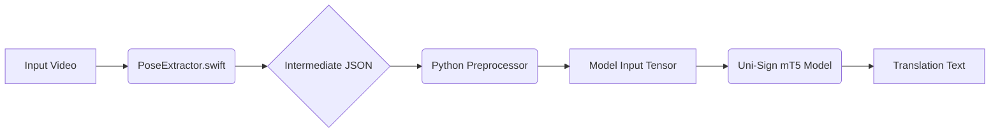

# Luồng Dữ Liệu: Từ PoseExtractor.swift đến Uni-Sign mT5

Tài liệu này mô tả chi tiết luồng xử lý dữ liệu (pipeline) để chuyển đổi từ video đầu vào, qua công cụ trích xuất pose bằng Swift (Apple Vision Framework), và cuối cùng đưa vào mô hình Uni-Sign (mT5) để dịch ngôn ngữ ký hiệu.

## Tổng Quan Pipeline

---

## Bước 1: Trích Xuất Pose (PoseExtractor.swift)

Đây là bước thu thập dữ liệu thô từ video sử dụng Apple Vision Framework.

**Input:** File video (`.mp4`, `.avi`, `.mov`).
**Process:**
1.  Đọc từng frame của video.
2.  Sử dụng Vision Framework để detect:
    *   `VNHumanBodyPoseObservation`: Lấy 9 điểm thân trên (Mũi, Tai, Vai, Khuỷu, Cổ tay).
    *   `VNHumanHandPoseObservation`: Lấy 21 điểm cho mỗi bàn tay (Trái/Phải).
    *   `VNFaceLandmarkRegion2D`: Lấy đường bao mặt (Jawline), môi trong (Inner Lips), và mũi (Nose/Nose Crest).
3.  **Quan trọng:** Mapping và Sampling dữ liệu ngay tại bước này hoặc xuất ra raw để Python xử lý. Để tối ưu, Swift nên xuất ra dạng JSON thô chuẩn hóa.

**Output (Intermediate JSON):**
File JSON chứa mảng các frame. Mỗi frame chứa tọa độ `(x, y)` và độ tin cậy `confidence` cho từng nhóm điểm.
*   Lưu ý: Tọa độ Vision là (0,0) ở góc dưới-trái. Cần lật trục Y (`y = 1 - y`) để khớp với chuẩn ảnh thông thường (0,0 ở góc trên-trái).

---

## Bước 2: Tiền Xử Lý Dữ Liệu (Python Preprocessor)

Bước này chuyển đổi JSON từ Swift thành định dạng Tensor chính xác mà mô hình Uni-Sign yêu cầu (tương tự class `S2T_Dataset` trong `datasets.py`).

**Input:** File JSON từ Bước 1.
**Process:**
1.  **Load JSON:** Đọc dữ liệu pose.
2.  **Sampling & Mapping (Nếu chưa làm ở Swift):**
    *   **Body (9 điểm):** Map trực tiếp tên khớp sang index 0-8.
    *   **Hands (21 điểm/tay):** Sắp xếp lại thứ tự khớp ngón tay theo chuẩn COCO.
    *   **Face (18 điểm):** Thực hiện thuật toán sampling để lấy 9 điểm Jawline, 8 điểm Inner Lips, 1 điểm Nose Tip từ các đường contour.
3.  **Normalization (Quan trọng):**
    *   Dựa vào hàm `crop_scale` trong `datasets.py`.
    *   Tính toán bounding box bao quanh các điểm valid.
    *   Scale và dịch chuyển tọa độ về khoảng `[-1, 1]`.
    *   Mask các điểm có độ tin cậy thấp (`confidence <= 0.3` thành `0`).
4.  **Format Conversion:**
    *   Tạo dictionary `kps_with_scores` với các key: `'body'`, `'left'`, `'right'`, `'face_all'`.
    *   Mỗi key chứa Tensor kích thước `(T, N, 3)` (Time, Number of joints, 3 channels: x, y, conf).

**Output:** Dictionary `src_input` chứa các Tensor đã chuẩn hóa.

---

## Bước 3: Mô Hình Hóa & Dịch (Uni-Sign mT5)

Bước này đưa dữ liệu đã tiền xử lý vào mô hình để inference.

**Input:** Dictionary `src_input`.
**Process:**
1.  **Projection:** Các điểm pose `(x, y, score)` được đưa qua lớp `Linear` để chiếu lên không gian vector ẩn (hidden dim).
2.  **Spatial-Temporal GCN:**
    *   Dữ liệu đi qua các lớp GCN không gian (Spatial) để học mối quan hệ giữa các khớp xương trong cùng một frame.
    *   Sau đó đi qua GCN thời gian (Temporal) để học chuyển động qua các frame.
    *   Mô hình có các nhánh riêng cho: Body, Left Hand, Right Hand, Face.
3.  **Fusion:** Các đặc trưng từ các nhánh được gộp lại (concat).
4.  **Transformer Encoder-Decoder (mT5):**
    *   Đặc trưng gộp được đưa vào mT5 Encoder.
    *   mT5 Decoder sinh ra chuỗi văn bản dịch (Translation).

**Output:** Chuỗi văn bản (String) kết quả dịch.

---

## Tóm Tắt Kỹ Thuật

| Thành phần | Nhiệm vụ chính | Input | Output |
| :--- | :--- | :--- | :--- |
| **PoseExtractor (Swift)** | Detect, Sampling, Coordinate Flip | Video File | JSON (Normalized Coordinates) |
| **Python Converter** | Parse JSON, `crop_scale`, Tensorize | JSON | Dict of Tensors `(T, N, 3)` |
| **Uni-Sign (PyTorch)** | GCN Encoding, mT5 Decoding | Dict of Tensors | Text (Translation) |
